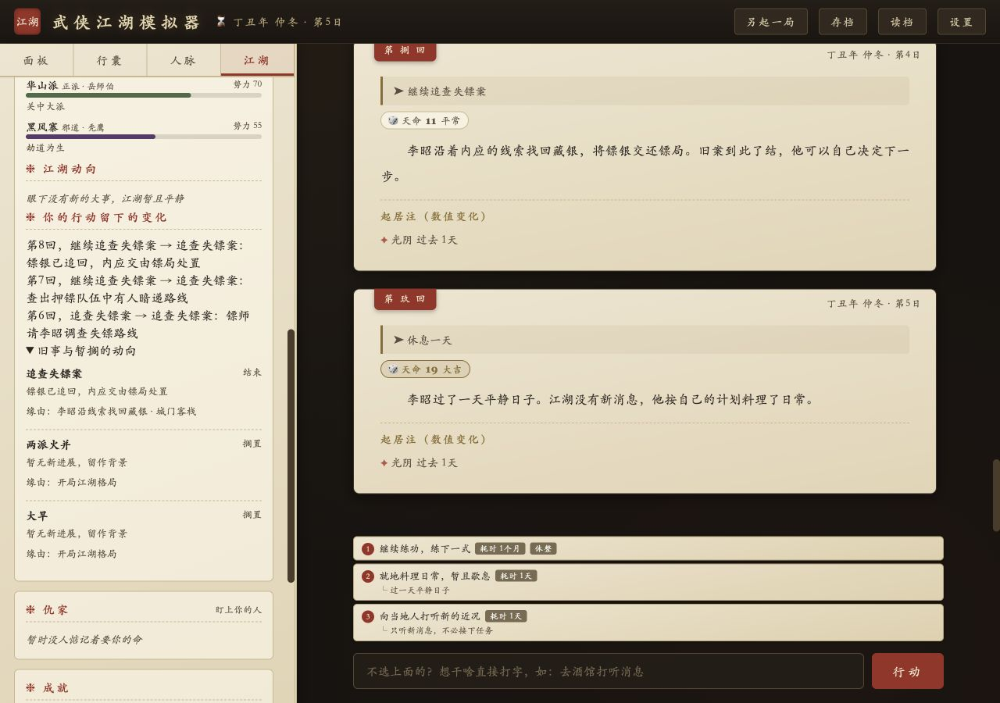

# 世界推演与结算修复验收

日期：2026-10-05。范围：当前工作区 index.html；保留修改前已有的源码、测试与资产改动。存档格式升级至 v11，加载旧存档时自动迁移。

## 已实现的行为

- 世界事件有稳定 ID、起因、参与者、位置、阶段和结果。正在发生、升级、暂搁和已结束分开保存；完成的事归档，新发生的同类事件必须引用旧事并有新原因。重复新建活动事件、重播结案事件在提交前拒绝。
- 玩家行动优先。连续练功、疗伤、经营和调查可以继续；防卡住先推进当前目标，不强制插入陌生人或换城。新信息和阶段变化写入行动后果，江湖面板能查看原因与结果。
- 固定随机事件只作为一次性种子，结合行动、季节和存活势力过滤；平静回合允许没有风闻和人物琐记。清除旧提示词中强制转场、禁止连续练功与每回必须有风闻的冲突规则。
- 明确空关注列表清空，省略字段保留。持续推进会刷新关注时间；放弃只是退出或搁置，不伪称结案。消息保存为知识，不自动接受任务。
- 人物近况与传闻持久记忆，区分已证实与未证实；重要事实独立保存并按当前行动检索。远方更新不会被记成见面，转场清空旧在场人物，普通档跨地点探访要旅行。
- 名录和榜单中同名人物每年只计算一次成长、死亡与老化，再同步字段。事件关联人物在事件创建后死亡、关联势力被吞并时，旧冲突退出；调查早已死亡的受害者不会因此自动结案。
- 时间以天累计：问话和短等待不扣整月生活费，满30天才触发月结算；自由输入时长、长闭关与短选项使用同一时间结果。多月月例累计，短回合不会重复展示上一回月例。
- 叙事前在克隆状态中预演时间与世界变化。模型输出先校验必需字段、类型、引用、数值判定和事件状态；矛盾输出修正一次，仍错误则保留可重试行动。禁止剧情杀的自由度必须重写正文。
- 回合在克隆状态中结算，成功后一次提交，使用事务 ID 防重复。断线重试沿用原判定与时间预演；门派战余波保存完整上下文；提交后显示失败保存待恢复章节，不重发奖励。
- 对话请求有独立标识和取消，赠礼成功后扣除，物品只移除一份。旧回合回复与后台历史摘要不能串入新局。
- 接口增加取消、空闲超时和总时限，降低默认输出预算，收窄人物上下文。手机保留纸墨风格，解除缩放限制，增加字号，减少创建界面嵌套滚动并固定操作行。

## 已完成的验证

1. `node test/world-state.cjs`：44 项全部通过。实际加载当前三个脚本，包含 25 回连续剧情、事件完成不回流、明确放弃、空列表、旧档迁移、日月精度、人物一致性、错误输出、事务回滚、网络失败重试、旧回复与旧摘要隔离等。
2. `node test/battle-regression.cjs /tmp/wuxia-before-world-fix.html`：与施工前精确备份对照，五种实力差、每种100场，共500场固定随机种子比武的胜负及回合数完全一致。只说明战斗计算未改变，不代表全部战斗界面都已验收。
3. Codex 应用内浏览器，localhost 模拟接口：实际创建角色、连续5回练功，地点保持不变并逐式增长；失镖案从发生、升级到追回镖银，结案后继续追查选项消失，世界面板归档并显示三次行动的后果；刷新保留。
4. 模拟 HTTP 503：显示重试/换行动，刷新仍有续接原行动入口；改选休息一天成功，金钱不重复扣除。
5. 手机390×844、横屏844×390：文档宽度分别等于视口宽度，未见横向溢出。大字设置20px实际生效。最后检查页面没有捕获到控制台错误。
6. `git diff --check` 通过。

## 验收边界与后续优化

本次浏览器使用本机模拟接口，没有调用真实模型、读取真实密钥或发布线上。真实模型20—30回多分支长局的因果一致性、重复率和叙事质量仍需实测；不能由Mock通过推断。

人物身份目前仍沿用准确姓名关联，未全面迁移为独立人物ID；NPC生活事件通过知识与人物记忆保存，死亡、婚嫁等数值和关系变化仍需要模型同时输出结构化更新，尚未实现通用自主目标规划器。事件与记忆已分成独立逻辑段，发布仍保留单文件入口，后续可渐进拆文件。普通回合断线已浏览器验收，门派战上下文与显示故障恢复由隔离回归验证；没有宣称全部玩法的失败重载都做过浏览器验收。

可复测入口：运行 `node test/qa-server.cjs` 后访问 `http://127.0.0.1:8967/__qa`；该路径仅在QA服务中注入模拟配置，正常游戏入口不注入。输入“继续练功”“追查失镖案”“继续追查失镖案”“模拟断线”“休息一天”可观察相应路径。生产 index.html 没有测试接口或虚拟密钥。
